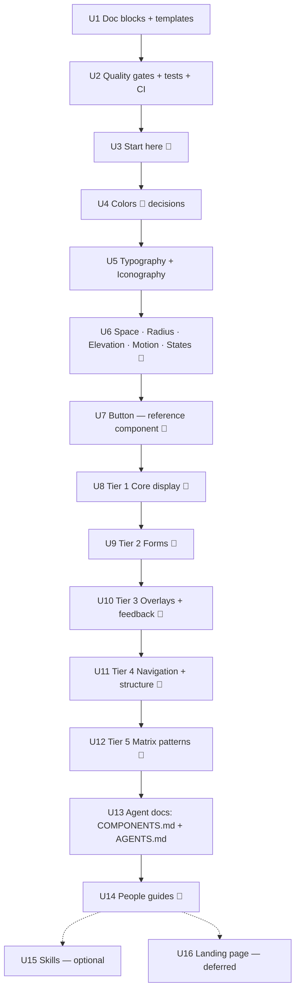

# feat: Build the Matrix OS design system library

## Overview

Build the Matrix OS design system as working code in this repo. The build runs in five phases, each one step at a time with review stops:

1. **Library workbench:** the reusable doc blocks and quality checks every page relies on.
2. **Start here + Foundations:** colors, typography, iconography, spacing, radius, elevation, motion, interaction states.
3. **Components:** shadcn base, restyled only with Matrix tokens. Basics come first, in dependency order. Each component ships with a docs page and a small agent file.
4. **Guides:** markdown for people and AI agents (decision tree, pattern guides, optional skills).
5. ~~A playful landing page~~ **deferred** (user decision, 2026-09-28). For now `/` redirects to `/library`.

UI consistency is the priority. Website architecture (Library/Guides split, card-grid index) waits until the end.

## Problem Frame

Matrix OS ships 7 UI surfaces with 6+ separate token sets:
- 5 different "primary" colors
- 6 font stacks
- 4 separate Button implementations
- about 600 hardcoded hex values in web-shell components

The approved brand (`DESIGN.md` + Figma "Styles" page) exists but the product doesn't use it (see `../matrix-os-design/01-ui-audit.md` and `../matrix-os-design/02-figma-vs-design-md.md`). This repo becomes the **single, working implementation** of that brand: one token file, one component per concept, documentation Matrix engineers and their coding agents can copy from directly.

The layout and page anatomy follow the design system:
- Start here → Foundations → Components
- Every component page runs Usage → Variants → Sizes → With icon → Shape → States → API reference → Guidelines → Related
- Human docs on the site, agent docs as markdown in the repo

## Requirements Trace

### Tokens and foundations

- **R1.** One token source (`styles/tokens.css`) drives every foundation page, component and the site itself. No component uses a raw value.
- **R2.** All foundations are documented before components: colors, typography, iconography, spacing, radius, elevation, motion, interaction states.
### Components and docs

- **R3.** Components come from shadcn, restyled to Matrix branding, and are built basics-first in dependency order.
- **R4.** Every component page uses the same anatomy: usage, variants, sizes, with icon, shape, states, API reference, guidelines, migration map (when it replaces existing Matrix code), related (sections that don't apply are omitted).
- **R5.** Every code sample on the site is the real file that renders the preview. The code shown is the code that runs. "Start here" lists what a consumer needs for pasted code to work in another app: the token CSS, the `@theme` block, the `radix-ui` package, the `cn` config and the path aliases.
- **R6.** Every component ships with a markdown agent file in the same step (user decision, 2026-09-28).
### Guides and landing

- **R7.** Cross-cutting guides come after the library: agent decision tree (`COMPONENTS.md`), pattern guides, optional skills.
- **R8.** *(Deferred)* A playful landing page with the Matrix mark. Not in this plan's build; see Deferred to Separate Tasks.
### Process and quality

- **R9.** The build is incremental with review stops, so a non-developer owner can review visually and steer.
- **R10.** Automated gates keep the audit's failure modes (hex literals, arbitrary values, tiny text, duplicate components) from coming back.

## Scope Boundaries

- **Landing page:** removed for now; `/` redirects to `/library`.
- **Site shell (done 2026-09-28, user request):** layout ahead of schedule. Floating pill nav (logo · Library · Guides · GitHub), plain sidebar, neutral white/gray site chrome (`styles/site.css`) so Matrix components stand out. Content paths are now `content/docs/library/**` and `content/docs/guides/**`; the paths in this plan that say `content/docs/foundations|components|guides` mean these.
- **Dark mode:** out of scope (user decision, 2026-09-28). Components use semantic tokens only and no `dark:` variants, so a dark palette can be added later without rewriting components.
- **Website architecture** (Library/Guides split, card-grid library index, floating nav): not now. Only a minimal version arrives with the landing page in Phase E.
- **Matrix theme presets** (winxp, nord, dracula…): out of scope. Tokens are structured so a theme only remaps semantic tokens.
- **Native platforms** (SwiftUI macOS, Expo mobile): out of scope. Web/React only.
- **Migrating Matrix product code** to this system: out of scope.

### Deferred to Separate Tasks

- **Landing page (was U16):** removed for now to keep the site simple (user, 2026-09-28). Unit 16 stays below for reference and is not scheduled.

- **shadcn registry** (`public/r/*.json`, so Matrix engineers can `shadcn add` from this site): after the library is stable. Component files are kept in standard shadcn layout so this is additive.
- **Figma sync:** components are not rebuilt in Figma in this plan. Code is the working source for this repo; Figma parity is a later task.
- **Dark palette:** a separate plan once the founders approve adding it.
- **Deployment to Vercel** and sharing with the founders: can happen at any review stop. It isn't a unit here.

## Context & Research

### Relevant Code and Patterns

- `styles/tokens.css`: primitives (6 scales × 10), shadcn-named semantic tokens, radius, shadow color, durations. Values marked `PROVISIONAL` need decisions.
- `app/global.css`: `@theme inline` maps tokens to Tailwind utilities (`bg-primary`, `text-h1`…`text-machine`, `rounded-lg`, `shadow-md`, `font-heading`). Matrix scales replace Tailwind's default green/teal/blue/neutral.
- `fumadocs-ui/css/shadcn.css` (imported in `app/global.css`): the docs chrome reads the same `--background/--primary/--border…` variables. **Any semantic token change also restyles the site itself.**
- `components.json`: shadcn new-york, aliases `@/components/ui`, `@/lib/utils` (`lib/utils.ts` re-exports shadcn's `cn`; U1 configures it for the Matrix type scale). Its CSS target is `app/global.css`, so review every `shadcn add` diff there.
- `content/docs/**` + `meta.json`: page tree and ordering; `components/mdx.tsx` registers MDX components.
- `CLAUDE.md`: repo rules (tokens only, one component per concept, min sizes, Gold focus, wordmark).
- Matrix product usage (from `matrix-os`), which informs component priority:
  - Shell shadcn set: badge, button, button-group, card, collapsible, command, context-menu, dialog, drawer, input, label, scroll-area, select, separator, sonner, switch, tabs, textarea, tooltip.
  - Radix primitives most used: dropdown-menu (10), tooltip, popover, context-menu, dialog.
  - Desktop primitives: Button, IconButton, Dialog, ContextMenu, StatusDot, EmptyState.
  - DESIGN.md component specs: button, card, input, badge, dialog, navigation, app-chrome.

### Institutional Learnings

- There's no `docs/solutions/` yet. The two audit docs in `../matrix-os-design/` serve as the learnings. Key lessons:
  - agent-written UI drifts without guardrails
  - variant names diverged (`default`/`primary`, `destructive`/`danger`)
  - raw `<button>` far outnumbers the component
  - text at 8–11px is common

### External References

- DS (live): page anatomy, "copy, paste, done", "fewer options, faster decisions", two-audience docs, `COMPONENTS.md` decision tree, per-component agent files, guard suite, docs-with-change rule.
- shadcn CLI 4.x (current: 4.21), new-york style on the unified `radix-ui` package (the Matrix shell already imports from `radix-ui`).
- `fumadocs-typescript` 5.x: `AutoTypeTable` generates prop tables from TypeScript types, which keeps API references from drifting.
- Test tooling: Vitest 4, Testing Library, `vitest-axe` for automated accessibility checks.

## Key Technical Decisions

- **Variant names follow DESIGN.md, not shadcn defaults.** Button uses `primary · secondary · ghost · destructive · link` (shadcn's `default` becomes `primary`; `outline` merges into `secondary`). Sizes are `sm · md · lg` plus `icon`. Each component doc includes a **migration map** from the 4 current Matrix Buttons (`default→primary`, `outline→secondary`, `danger→destructive`, `subtle→secondary/ghost`). *Rationale:* 3 of 4 Matrix sources and DESIGN.md already say `primary`, and the migration map makes adoption cheap.
- **Fewer options.** Only variants and sizes that Matrix product usage or DESIGN.md justify. Adding more is a later, deliberate decision.
- **Examples are real files, found through a generated registry.** A script generates `examples/__index__.tsx`, which maps each example name to a lazy import and its file path (shadcn's `__registry__` pattern). `ComponentPreview` is a server component. It looks up the example by name, throws a build error on a miss, reads the source with `fs`, and highlights it with Fumadocs' highlighter. *Rationale:* satisfies R5 (a bundler can't import from a runtime path string), and the code can't drift from the preview.
- **`cn` knows the Matrix type scale.** `lib/utils.ts` configures shadcn's `cn` (`cn/config`) with the `text-display…text-machine` font-size class group. Otherwise `cn('text-body-sm text-primary-foreground')` silently drops the size. *Rationale:* verified in-repo by the feasibility review; every component passes classes through `cn`. The list must stay in sync with the `--text-*` tokens.
- **One focus mechanism.** The global `:focus-visible` outline in `app/global.css` is the only focus style. After `shadcn add`, components remove shadcn's `outline-none` / `focus-visible:ring-*` classes. The token guard bans those classes in `components/ui`.
- **Never-color-only is enforced by types.** Status-bearing components (Badge status tones, Status indicator, Agent chip) make `label` a required prop, tested with `@ts-expect-error`.
- **Start from existing shadcn items** wherever one exists: `field`, `empty`, `kbd`, `spinner` and `button-group` are shadcn registry items, not custom builds. Doc page names may differ, e.g. the "Empty state" page documents `components/ui/empty.tsx`.
- **API tables are generated** from component prop types via `fumadocs-typescript`, with a manual table only as fallback.
- **Typography via utilities, not a Text component.** `text-h1…text-machine` + `font-heading/sans/mono` already encode the scale. *Rationale:* fewer abstractions, and it matches how the Matrix product styles text.
- **Icons: `lucide-react`**, which Matrix already uses. Sizes are tied to control sizes. The rabbit mark is a brand asset, not an icon.
- **Brand accent naming:** shadcn `accent` = hover/selected surface. Brand Coral = `attention`. Status colors are `success · warning · destructive · info`, and each always pairs with an icon or label.
- **Component customization = own the code.** After `shadcn add`, the file is Matrix's. Never re-run `add` over a customized file. Record notable deviations from upstream in the file header.
- **Build order ≠ navigation order.** Components are built in dependency order but listed alphabetically in the sidebar.
- **Tests:** each component gets a Vitest + Testing Library + `vitest-axe` test in jsdom, asserting render, variant classes, ARIA attributes and keyboard behavior. `vitest.setup.ts` adds the jsdom polyfills Radix needs (`hasPointerCapture`, `scrollIntoView`, `ResizeObserver`). **Layout, visible focus, layering, motion and Lighthouse can't be proven in jsdom.** They are checked visually with screenshots at each review stop, never claimed as unit-test coverage. axe in jsdom doesn't check color contrast; the token contrast test covers that. A token guard script enforces R10.

## Open Questions

### Resolved During Planning

- *Dark mode timing?* Out of scope for this plan (user).
- *When do agent files get written?* Per component in the same unit; cross-cutting agent docs at the end (user).
- *Website architecture now?* No, it comes at the end with the landing page (user).
- *Build order?* Foundations first, then components basics-first (user). Tiers below.
- *Landing page?* Not now. The site is the docs with left navigation only (user).
- *Responsive rules?* Decided per component, not as a foundation (user). Every component page's Guidelines state how it adapts to window size and touch.
- *Focus ring contrast* (Gold is 1.5:1; needs 3:1): **decide later** (user). Options on the table: a two-tone ring (Gold + dark inner ring), a darker gold, or an exemption. The contrast test marks the focus pair as pending until decided. It must be decided before U7 Button ships.

### Needs a decision at a review stop (non-blocking for the plan)

- **Adoption checkpoint (open; raised by review, not yet answered).** A library Matrix never adopts becomes one more style system. The options: (a) share with the Matrix team after Foundations + Button and confirm ownership, the Button API and the source of truth before building ~30 more components; (b) build everything and share at the end; (c) build directly into matrix-os `packages/brand` / `packages/ui`. Ask again at the U6 review stop.

These use PROVISIONAL values until decided. Tokens are centralized, so changing them later is a one-line edit.

- Default border: sage `#E0E1CA` (off-scale) vs Green 100 `#E4EDD4` vs Neutral 200 `#E1E0E0` vs current product `#DCD9CC`. Input borders must reach 3:1 or rely on another visible boundary. Decide at the U4 review.
- Status on-color pairs and subtle surfaces. Decide at the U4 review.
- `secondary` and `accent` surfaces: currently Green 100. Decide at the U4 review.
- Source of truth for the Matrix team (Figma-first per DESIGN.md vs code-first per Matrix). This affects the "Start here" wording. Decide at the U3 review; founders' input needed.

### Deferred to Implementation

- Whether `AutoTypeTable` handles `cva` `VariantProps` cleanly, or needs a hand-written props type for display.
- Exact spinner/skeleton motion timing within the 120–240ms rule.
- Whether `Field` (label + help + error) should be one component or a composition pattern. Decide when building Tier 2 with real examples.
- Preview isolation details: how much of Fumadocs' prose styling must be neutralized inside previews.
- The source of Agent chip's agent logos (matrix-os `shell/public/agent-logos`?), their licensing and format.
- Whether `sonner` pulls a separate `next-themes` instance that ignores the forced light theme.

## Output Structure

```text
components/
  ui/                       # Matrix-styled shadcn components (one file per component)
    __tests__/              # <name>.test.tsx per component
  docs/                     # site-only doc blocks: ComponentPreview, TokenSwatch, Guidelines, Related…
  brand/                    # rabbit mark (exists)
examples/
  <component>/<example>.tsx # the exact code each preview renders and shows
content/docs/
  index.mdx                 # Start here
  foundations/*.mdx
  components/*.mdx
  guides/*.mdx              # Phase D
agents/
  components/<name>.md      # per component, written with the component
  COMPONENTS.md             # Phase D decision tree + index
templates/
  component-page.mdx        # page skeleton with the anatomy
  agent-doc.md              # agent file skeleton
scripts/
  check-tokens.mjs          # token guard (R10)
tests/
  tokens/contrast.test.ts
.github/workflows/ci.yml
AGENTS.md                   # Phase D, points agents to agents/COMPONENTS.md
```

## High-Level Technical Design

> *This illustrates the intended approach and is directional guidance for review, not implementation specification. The implementing agent should treat it as context, not code to reproduce.*

**Build sequence and review stops (🛑 = stop for owner review)**



**Per-component recipe (used by U7–U12)**

```text
for each component:
  1. add shadcn base → components/ui/<name>.tsx
     review the diff of app/global.css + package.json; reject injected cssVars / neutral palettes
  2. restyle with semantic tokens only; rename variants to the Matrix API;
     remove dark:, text-white, outline-none/ring focus classes
  3. examples/<name>/*.tsx — one file per preview (default, variants, sizes, icon, shape, states)
  4. content/docs/components/<name>.mdx from templates/component-page.mdx
       Usage → Variants → Sizes → With icon → Shape → States → API (generated) →
       Guidelines (✓/✗) → Migration map (from current Matrix code) → Related
  5. agents/components/<name>.md from templates/agent-doc.md
       when to use / when not · props · rules · copy-paste example
  6. components/ui/__tests__/<name>.test.tsx — render · variants · keyboard · axe
  7. guidelines include responsive behavior (window size, touch vs pointer)
  8. gates green → screenshot → review
```

## Implementation Units

### Phase A — Library workbench

- [ ] **Unit 1: Doc building blocks and page templates**

**Goal:** Reusable blocks so every foundation and component page looks and behaves the same.

**Requirements:** R4, R5, R9

**Dependencies:** None

**Files:**
- Create: `components/docs/component-preview.tsx` (live preview + code tab, reads the example's source)
- Create: `components/docs/variant-grid.tsx` (a labeled preview card per variant)
- Create: `components/docs/token-swatch.tsx`, `components/docs/token-table.tsx` (for foundations)
- Create: `components/docs/guidelines.tsx` (✓ do / ✗ don't list)
- Create: `components/docs/related.tsx` (cards linking to related components)
- Create: `templates/component-page.mdx`, `templates/agent-doc.md`
- Create: `scripts/build-examples-index.mjs` → generates `examples/__index__.tsx`
- Create: `vitest.config.ts`, `vitest.setup.ts` (test setup lives here because U1 is the first unit with tests)
- Modify: `components/mdx.tsx` (register the blocks), `package.json` (`fumadocs-typescript`, test deps, `prebuild` runs the index script), `lib/utils.ts` (Matrix-aware `cn`)
- Test: `tests/docs/examples-index.test.ts`, `tests/lib/cn.test.ts`

**Approach:**
- The preview container is visually neutral and isolated from prose styles (`not-prose`), with a paper surface and a subtle border.
- The code tab shows the exact example file and a copy button.
- Templates encode the anatomy order and headings so pages never drift.

**Patterns to follow:** Fumadocs `Tabs`/`CodeBlock` components; variant cards (label + code toggle).

**Test scenarios:**
- Happy path: the index script maps every file in `examples/**` to a name and its path; the lookup returns the matching entry.
- Error path: looking up an unknown example name throws with the name in the message, so the build fails instead of showing a blank preview.
- Happy path: `cn('text-body-sm text-primary-foreground')` keeps both classes, and `cn('text-h1 text-primary', 'text-h2')` keeps the color.
- Integration (verified by `next build` + screenshot, not jsdom): an MDX page with `ComponentPreview` renders the example and its highlighted source, and the copy button copies it.

**Verification:** A throwaway demo page shows a preview, variant grid, guidelines and related cards, all styled only with tokens.

- [ ] **Unit 2: Quality gates, test setup and CI**

**Goal:** Automated guardrails for R10, runnable as one command locally and on every push.

**Requirements:** R1, R10

**Dependencies:** Unit 1

**Files:**
- Create: `scripts/check-tokens.mjs`
- Create: `tests/tokens/contrast.test.ts`, `tests/scripts/check-tokens.test.ts`
- Create: `.github/workflows/ci.yml`
- Modify: `package.json` (scripts: `test`, `check:tokens`, `gates`), `CLAUDE.md` (mention the gates)

**Approach:**
- The token guard scans `components/ui`, `components/docs`, `examples`, `app` and fails on any of these:
  - hex/rgb/hsl literals outside `styles/tokens.css`
  - arbitrary values *in value position* (`w-[13px]`, `text-[10px]`, `bg-[#…]`, `ring-[3px]`). Arbitrary *variants/selectors* are allowed (`[&_svg]:`, `data-[…]:`, `aria-[…]:`, `has-[…]:`), and so are Radix CSS-variable references (`(--radix-*)`, `var(--radix-*)`).
  - Tailwind palette or keyword colors that aren't Matrix tokens (`red-500`, `gray-400`, `text-white`, `bg-black`)
  - `dark:` variants (dark mode is out of scope)
  - `outline-none` and `focus-visible:ring-*` in `components/ui` (single focus mechanism)
  - default Tailwind text sizes (`text-xs`, `text-sm`…) and arbitrary sizes. Use the Matrix scale. `text-label` (11px, DESIGN.md) is allowed.
  - a second exported component with the same name in `components/ui`
- The contrast test resolves `var()` chains in `tokens.css` and checks an **explicit list** of pairs: 4.5:1 for text, 3:1 for the focus indicator and for input borders. Decorative dividers are exempt. The focus pair is measured according to the focus-ring decision (see Open Questions).
- `gates` = lint + types + tests + token check + build. CI runs `gates`.

**Test scenarios:**
- Happy path: a clean fixture passes the guard.
- Error path: fixtures containing `#fff`, `w-[13px]`, `bg-red-500`, `text-white`, `text-[10px]`, `text-xs`, `dark:bg-card` each fail with file:line and the broken rule.
- Happy path: stock-shadcn-style selectors (`[&_svg]:size-4`, `has-[>svg]:px-3`, `data-[state=open]:bg-accent`, `max-h-(--radix-select-content-available-height)`) and `text-label` pass.
- Edge case: hex inside `styles/tokens.css` is allowed; hex in a code comment in an example still fails (examples are copy-paste sources).
- Happy path: the current semantic pairs pass AA. Error path: a deliberately low-contrast pair fails with the measured ratio.

**Verification:** `gates` passes on the current repo, and CI runs on push.

### Phase B — Start here and Foundations

- [ ] **Unit 3: Start here** 🛑 *review stop*

**Goal:** One page that explains what the system is, how to use it, the principles, and how Matrix migrates to it.

**Requirements:** R2, R9

**Dependencies:** Unit 2

**Files:** Modify: `content/docs/index.mdx` (becomes "Start here"), `content/docs/meta.json`

**Approach:**
- **How to use:** copy a component from the site, or (later) install from the registry.
- **Principles:** Matrix's five, plus "Copy, paste, done", "Fewer options, faster decisions" and "Semantic before primitive".
- **Source of truth:** state the current hierarchy and flag the open Figma-vs-code question.
- **Migration:** new UI uses the system → migrate on touch, one screen per PR → retire the duplicates. Name the concrete duplicates from the audit (4 Buttons, 3 Cards…).

**Test expectation:** none (content page).

**Verification:** The page builds. Owner review of wording and the source-of-truth decision.

- [ ] **Unit 4: Colors** 🛑 *review stop with decisions* (page built 2026-09-28, with `lib/tokens.ts` reading values from `tokens.css`, plus the swatch, role-table, tint-table, guideline and related blocks pulled forward from U1; status text roles and tint sets added as PROVISIONAL; focus ring, border and secondary/accent still open)

**Goal:** A complete color foundation: palette, semantic roles, contrast, and status usage. PROVISIONAL tokens get resolved.

**Requirements:** R1, R2

**Dependencies:** Unit 3

**Files:**
- Modify: `content/docs/foundations/colors.mdx`, `styles/tokens.css` (resolve PROVISIONAL once decided)
- Test: `tests/tokens/contrast.test.ts` (extend with the status pairs)

**Approach:**
- **Sections:**
  - brand colors (5)
  - scales (6 × 10 swatches from tokens)
  - semantic roles table (token · value · use for · never use for)
  - status colors (always with icon/label)
  - contrast pairs (measured)
  - "Coral is attention, not text"
- Present the border options side by side with contrast ratios, including the value the product ships today (`#DCD9CC` from `@matrix-os/brand`), so the owner/founders can pick knowing the migration cost.
- Add PROVISIONAL **on-color pairs for each status** (`--success-foreground`, and a subtle surface + text pair such as warning text = gold-700 on gold-50). The current status fills fail 4.5:1 against paper (warning 2.57, info 3.89, success 4.19).
- Add **semantic tokens for Matrix-specific colors**: `--status-ready/pending/failed/syncing` and `--window-close/minimize/maximize`. Tier 5 components use only these, so themes can remap them.

**Test scenarios:**
- Happy path: every swatch reads its value from `tokens.css` (no hardcoded hex on the page).
- Happy path: every semantic text pair ≥ 4.5:1, and the focus ring vs background ≥ 3:1.

**Verification:** The page renders from tokens. Decisions are recorded in `tokens.css` and the PROVISIONAL markers are removed.

- [ ] **Unit 5: Typography and Iconography**

**Goal:** Type scale and font roles, plus icon rules.

**Requirements:** R2

**Dependencies:** Unit 4

**Files:**
- Modify: `content/docs/foundations/typography.mdx`
- Create: `content/docs/foundations/iconography.mdx`
- Modify: `content/docs/foundations/meta.json`, `styles/tokens.css` / `app/global.css` (icon size tokens)

**Approach:**
- **Typography:** a specimen per style (live utilities), font roles, rules (body ≥14px; caption 12px only for metadata; label uppercase only when short), machine text for commands/paths/IDs. Note the Figma body-style bug so designers don't copy it.
- **Iconography:** lucide-react, sizes 16/20/24 tied to control sizes, one stroke weight, `currentColor`, icon-only needs a label, rabbit-mark usage rules.

**Test expectation:** none (content and tokens). The token guard covers the size rules.

**Verification:** The specimens render in the correct families. Icon sizes are available as tokens/utilities.

- [ ] **Unit 6: Spacing, Radius, Elevation, Motion, Interaction states** 🛑 *review stop: Foundations complete*

**Goal:** The remaining foundations, including one shared definition of hover/active/focus/disabled/selected. The audit found 5 different focus treatments; this unit fixes that.

**Requirements:** R1, R2

**Dependencies:** Unit 5

**Files:**
- Modify: `content/docs/foundations/{spacing,radius,elevation,motion}.mdx`
- Create: `content/docs/foundations/states.mdx`
- Modify: `styles/tokens.css` (z-index/layer tokens for overlays; state tokens such as the disabled opacity and the hover overlay)
- Modify: `app/global.css`
- Test: `tests/tokens/contrast.test.ts` (disabled text remains legible if required)

**Approach:**
- **Spacing:** 4px grid, preferred steps, component density.
- **Radius:** 6/8/12/16/24/full with "what gets which".
- **Elevation:** 5 ink-tinted shadows plus surface layering (canvas → paper → elevated); glass only for transient overlays.
- **Motion:** 120/180/240ms, easing, reduced motion.
- **States:** a visual matrix of each state on a neutral control. The Gold focus ring with offset is the only focus style.

**Test expectation:** none beyond the contrast additions (content and tokens).

**Verification:** All foundation pages are complete. The owner signs off on Foundations before any component is built.

### Phase C — Components (basics first)

Every unit in this phase follows the per-component recipe (see High-Level Technical Design) and produces, per component:
- `components/ui/<name>.tsx`
- `examples/<name>/*.tsx`
- `content/docs/components/<name>.mdx`
- `agents/components/<name>.md`
- `components/ui/__tests__/<name>.test.tsx`

- [ ] **Unit 7: Button — the reference component** 🛑 *review stop*

**Goal:** Build Button to production quality. It becomes the template every later component copies.

**Requirements:** R3, R4, R5, R6

**Dependencies:** Unit 6

**Files:**
- Create: `components/ui/button.tsx`, `examples/button/*.tsx`, `content/docs/components/button.mdx`, `agents/components/button.md`
- Test: `components/ui/__tests__/button.test.tsx`
- Modify: `content/docs/components/meta.json`

**Approach:**
- **Variants:** primary, secondary, ghost, destructive, link.
- **Sizes:** sm 32, md 36, lg 44 (touch), plus icon (square) and round.
- **States:** hover, focus (global Gold focus style), disabled, loading (keeps its width).
- Decide here whether `tw-animate-css` is adopted for enter/exit animations and mapped to the `--duration-*` tokens. Later overlays depend on it.
- **Content:** leading/trailing icon.
- **Docs:** include the migration map from shell/desktop/packages/ui/symphony Buttons.
- **Guidelines:** one primary per region; verb + noun labels in sentence case; icon-only needs `aria-label`; don't disable without explaining.

**Test scenarios:**
- Happy path: each variant and size renders its expected token classes. The default is primary/md.
- Happy path: `asChild` renders a link with button styling.
- Edge case: icon-only without an accessible name fails the axe check (documented rule). With `aria-label` it passes.
- Edge case: `loading` keeps the label in the DOM (visually hidden, so the width holds; confirmed at the review stop), sets `aria-busy`, and blocks clicks and Enter/Space.
- Error path: `disabled` prevents click handlers and removes the element from the focus order (native disabled).
- Happy path: the rendered class list contains no `outline-none` or `focus-visible:ring-*`, so the global focus style applies. The visible Gold focus is confirmed by screenshot at the review stop.

**Verification:** Gates pass. The docs page matches the anatomy, and the owner approves it as the template for all components.

- [ ] **Unit 8: Tier 1 — Core display** 🛑

**Components (in order):** Badge (status tones, always with a label) → Card (paper, 16px radius, header/content/footer) → Separator → Kbd → Spinner + Skeleton → Avatar → Button group.

**Requirements:** R3–R6 · **Dependencies:** Unit 7

**Files:** the recipe files per component (Test: `components/ui/__tests__/{badge,card,separator,kbd,spinner,skeleton,avatar,button-group}.test.tsx`)

**Approach:** Kbd, Spinner, Skeleton and Avatar are here because later components depend on them, even though the audit didn't list them: Spinner → Button loading and Select loading; Skeleton → loading states; Avatar → Agent chip; Kbd → Tooltip/Command shortcuts. Kbd, Spinner and Button group start from shadcn's registry items. Badge merges the audit's three versions (shell badge, `packages/ui` Badge, brand `StatusPill`) into one API. Card follows DESIGN.md's card rules (nested content uses spacing, not nested cards).

**Test scenarios:**
- Happy path: each Badge tone renders token classes plus visible text. Error path: a status Badge without `label` is a type error (`@ts-expect-error` test).
- Happy path: Card slots render in order.
- Edge case: Skeleton and Spinner carry `motion-reduce:` classes that stop the animation (behavior confirmed at the review stop).
- Happy path: Avatar falls back to initials when the image fails.
- Happy path: Button group merges borders and keeps each button focusable.
- Integration: every component passes axe.

**Verification:** Gates pass; tier review.

- [ ] **Unit 9: Tier 2 — Forms** 🛑

**Components:** Label → Field (label + description + error) → Input → Textarea → Checkbox → Radio group → Switch → Select.

**Requirements:** R3–R6 · **Dependencies:** Unit 8

**Files:** the recipe files per component; Test: `components/ui/__tests__/{label,field,input,textarea,checkbox,radio-group,switch,select}.test.tsx`

**Approach:**
- Paper surface, 8–12px radius, Gold focus.
- Labels are always visible; placeholders show format only.
- Errors use text + icon + color, never color alone.
- Controls use `md` 36px, and 44px on touch.
- Field starts from shadcn's `field` item.
- Select guidelines define the **loading** state (while options load) and the **empty-options** state.

**Test scenarios:**
- Happy path: Field wires `aria-describedby` to description and error, and `aria-invalid` on error.
- Error path: the error state shows an icon and text, not just a red border.
- Happy path: Checkbox/Radio/Switch toggle with the keyboard (Space); Radio arrow keys move the selection.
- Happy path: Select opens with the keyboard, arrows through options, and closes on Escape with focus returned.
- Edge case: disabled and read-only states are visually distinct and not focusable (disabled).
- Edge case: Select with no options shows the documented empty message; loading shows a spinner and is announced (`aria-busy`).
- Integration: a small form example passes axe.

**Verification:** Gates pass; tier review.

- [ ] **Unit 10: Tier 3 — Overlays and feedback** 🛑

**Components:** Tooltip → Popover → Dropdown menu → Context menu → Dialog (+ Alert dialog) → Sheet → Toast (Sonner) → Alert (inline banner).

**Requirements:** R3–R6 · **Dependencies:** Unit 9 (uses Button, Field)

**Files:** the recipe files per component; Test: `components/ui/__tests__/{tooltip,popover,dropdown-menu,context-menu,dialog,alert-dialog,sheet,toast,alert}.test.tsx`

**Approach:**
- One overlay surface style: elevated neutral surface, `shadow-lg`, layer tokens from U6.
- Glass is allowed only where DESIGN.md allows it.
- Destructive confirmations always use Alert dialog.
- Toast = what happened; Alert = what is true now (borrowed from the feedback guide).
- Guidelines must define the **Dialog vs Sheet** rule (centered decision vs side panel of related content) and Sheet's default side.
- Guidelines must define **Toast** duration, screen position, max stack and dismiss behavior, aligned with the Matrix shell's single notification host (`ShellNotificationStack` in matrix-os).

**Test scenarios:**
- Happy path: Dialog traps focus, closes on Escape and overlay click, and returns focus to the trigger.
- Happy path: Alert dialog does *not* close on overlay click.
- Happy path: menu items are navigable with arrows; typeahead works; destructive items are styled with `destructive`.
- Edge case: Tooltip appears on keyboard focus, not only on hover.
- Happy path: Toast is announced to screen readers (live region).
- Integration: a Dropdown opened inside a Dialog portals its content and uses the higher layer-token class. Correct visual stacking is confirmed at the review stop.

**Verification:** Gates pass; tier review.

- [ ] **Unit 11: Tier 4 — Navigation and structure** 🛑

**Components:** Tabs → Scroll area → Collapsible / Accordion → Command (palette) → Empty state.

**Requirements:** R3–R6 · **Dependencies:** Unit 10

**Files:** the recipe files per component; Test: `components/ui/__tests__/{tabs,scroll-area,collapsible,accordion,command,empty-state}.test.tsx`

**Approach:**
- Command merges with Dialog for the palette pattern. Guidelines state how it's invoked (global ⌘K vs a trigger button) and who owns the shortcut.
- Empty state starts from shadcn's `empty` item: icon, headline, description, one primary action (matches matrix-os `specs/ux-guide.md`). Guidelines cover first-run, filtered-empty and error-empty variants.

**Test scenarios:**
- Happy path: Tabs use arrow-key navigation and the correct `aria-selected`.
- Happy path: Accordion expands/collapses with Enter/Space and sets `aria-expanded`.
- Happy path: Command filters as you type, arrows select, Enter runs, and "no results" shows an empty state.
- Edge case: Scroll area stays keyboard-scrollable.

**Verification:** Gates pass; tier review.

- [ ] **Unit 12: Tier 5 — Matrix patterns** 🛑

**Components:** Window chrome (title bar + Matrix Coral/Gold/Green window controls from DESIGN.md `app-chrome`) → Status indicator (ready/pending/failed/syncing = Green/Teal, Gold, Coral, Blue, each with icon and label) → Code / machine block (Geist Mono, copy, command prompt) → Agent chip (agent logo + name + status).

**Requirements:** R3–R6 · **Dependencies:** Unit 11

**Files:** the recipe files per component; Test: `components/ui/__tests__/{window-chrome,status-indicator,code-block,agent-chip}.test.tsx`

**Approach:** These use only the semantic status and window tokens from U4 (no brand primitives), and `label` is a required prop. They replace the desktop app's `StatusDot`, custom window chrome and ad-hoc terminal styling. Reference `matrix-os/design/components/app-chrome.md` for behavior.

**Test scenarios:**
- Happy path: window controls have accessible names (close/minimize/maximize) and work with the keyboard.
- Error path: a status without `label` is a type error (`@ts-expect-error` test).
- Happy path: the code block's copy button copies the exact text and announces "Copied".
- Integration: Agent chip composes Avatar + Status indicator without new tokens.

**Verification:** Gates pass; tier review; the component library is complete.

### Phase D — Guides (people and agents)

- [ ] **Unit 13: Agent entry points**

**Goal:** Machine-readable navigation for coding agents (R7).

**Requirements:** R6, R7

**Dependencies:** Unit 12

**Files:** Create: `agents/COMPONENTS.md`, `AGENTS.md`, `agents/matrix-os-snippet.md` (proposed text for matrix-os `CLAUDE.md`, so product-side agents find these docs). Modify: `CLAUDE.md` (point to `AGENTS.md`).

**Approach:**
- `COMPONENTS.md` has three parts:
  - A **decision tree keyed by product need** ("confirm a destructive action → Alert dialog"; "show agent state → Status indicator").
  - A component index linking `agents/components/*.md`.
  - Import rules.
- `AGENTS.md` holds the rules (tokens only, reuse components, never re-implement, and docs travel with the change).

**Test scenarios:**
- Happy path: a check (added to `gates`) confirms every component in `components/ui` has an agent file and an index row, and every index row resolves.
- Error path: removing an agent file fails the check.

**Verification:** An agent reading only `AGENTS.md` can find the right component for 5 sample needs.

- [ ] **Unit 14: People guides** 🛑

**Goal:** Pattern guides for Matrix-specific decisions (R7).

**Requirements:** R7

**Dependencies:** Unit 13

**Files:** Create: `content/docs/guides/{index,color-usage,feedback-and-status,forms,content-and-voice,ai-agents}.mdx`, `content/docs/guides/meta.json`. Modify: `content/docs/meta.json`.

**Approach:**
- **Color usage:** the semantic vs decorative decision tree.
- **Feedback & status:** agent/task states across toast/alert/status, i.e. what happened vs what is true now.
- **Forms:** validation timing, error copy.
- **Content & voice:** "Matrix OS" wordmark, sentence case, verb + noun labels.
- **AI agents:** how agents use the system and how to drive them.

**Test expectation:** none (content). The link check from U13 covers internal links.

**Verification:** Guides link to the components they govern; owner review.

- [ ] **Unit 15: Skills (optional)**

**Goal:** Reusable agent workflows: `ds-build` (a new component via the recipe, stopping for review between phases) and `ds-use` (build product UI only from the system).

**Requirements:** R7

**Dependencies:** Unit 14

**Files:** Create: `.claude/skills/ds-build/SKILL.md`, `.claude/skills/ds-use/SKILL.md`

**Approach:** The skills encode the per-component recipe and the gates, and reference `AGENTS.md`/`COMPONENTS.md` rather than restating them.

**Test expectation:** none (instructions). Verify by dry-running `ds-build` on a small component.

**Verification:** A fresh session can add one new component end-to-end with the skill and pass the gates.

### Phase E — Landing

- [ ] **Unit 16: Playful landing page** — *deferred, not scheduled*

**Goal:** A memorable front door with the Matrix rabbit mark (R8), plus the minimal navigation the site now needs (Library · Guides).

**Requirements:** R8

**Dependencies:** Unit 14

**Files:** Modify: `app/(home)/page.tsx`, `lib/layout.shared.tsx`. Create: `components/landing/*`.

**Approach:**
- Motion is built on the brand boot gradient (`bootGradientColors` in the Matrix brand package) and the dotted rabbit.
- It respects reduced motion.
- No new colors. The boot gradient stops (`#647141`, `#F1C377`, `#EAB6A7`, `#C6D8E3`, `#6D777D`) are off-scale. Either copy them into `tokens.css` as named brand tokens (like `--brand-sage`) or map them to the nearest scale steps. The owner decides at the review stop.
- Proposed structure (owner reviews): an animated rabbit mark + wordmark hero, a one-line pitch, two entry cards (Library · Guides) and a minimal footer.
- Decide at this point whether to add the card-grid Library index.

**Test scenarios:**
- Happy path: the landing renders; links to Library and Guides work.
- Edge case: with reduced motion on, animations are replaced by a static composition.
- Review-stop check (not in `gates`): Lighthouse accessibility ≥ 95 and no layout shift from the animation.

**Verification:** Owner review; gates pass.

## System-Wide Impact

- **Interaction graph:** `styles/tokens.css` feeds three consumers at once: Tailwind utilities (`app/global.css`), the Fumadocs site chrome (`fumadocs-ui/css/shadcn.css`) and every component. A token change restyles the site too, which is intended, but review U4/U6 changes on doc pages as well as on components.
- **API surface parity:** variant/size names chosen in U7 become the contract every later component follows, and the Matrix product will migrate to it. Changing them after U7 is expensive.
- **Integration coverage:** layering (Dropdown inside Dialog), focus return and form a11y are verified in U10/U9 integration scenarios, since unit tests on isolated components won't catch them.
- **Unchanged invariants:** brand primitive values (verified 60/60 against Figma) don't change in this plan. Only semantic mappings marked PROVISIONAL do.

## Risks & Dependencies

| Risk | Mitigation |
|------|------------|
| Scope is large (~35 components) and momentum fades | Tiered review stops; Button template first; each tier is shippable on its own |
| Re-running `shadcn add` overwrites Matrix customizations | Rule in `CLAUDE.md`: never re-add a customized file; deviations noted in the file header |
| Fumadocs prose styles leak into previews | `not-prose` isolation in `ComponentPreview` (U1); verified visually at the U7 stop |
| Founders change semantic decisions late | Semantic tokens are centralized; a change is a one-line edit plus a visual pass |
| Owner is not a developer, so reviews happen through code | Every review stop is visual (screenshots / local site) with plain-language summaries |
| Agents drift from rules over a long build | Gates in CI (U2), the `CLAUDE.md` rules, and later skills (U15) |
| Docs chrome (Base UI) and components (Radix) have separate portals/layers | Layer tokens govern Matrix components only; overlays are checked on doc pages at the U10 stop |
| CI build needs network for Google Fonts (`next/font`) | GitHub-hosted runners have network; noted in the CI workflow |
| Dark mode requested mid-build | Semantic-only styling and no `dark:` variants keep it additive; needs a separate plan |

## Success Metrics

- Zero hex/arbitrary values outside `styles/tokens.css` (gate enforced).
- One implementation per concept; every component has docs, an agent file and a passing test.
- Every semantic text pair meets WCAG AA.
- Matrix engineers can build a new screen using only this library and the guides.

## Sources & References

- Audit: `../matrix-os-design/01-ui-audit.md`; Figma check: `../matrix-os-design/02-figma-vs-design-md.md`
- Matrix brand contract: `matrix-os/DESIGN.md`, `matrix-os/design/components/*.md`
- Figma: file `xPG2FeYRtC9owCKSVXCqWA`, page "Styles" (`1:846`)
- DS: (library, component anatomy, AI agents guide)
- Fumadocs TypeScript: https://fumadocs.dev (AutoTypeTable); shadcn CLI 4.x
